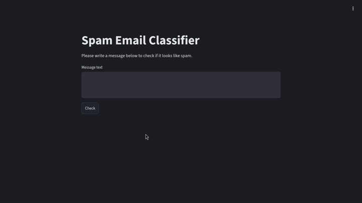

# MLOps-Enabled Spam Classifier

A modular, containerized Python system that tracks machine learning experiments, automatically tunes hyperparameters, and serves text predictions via a decoupled microservice deployment stack.

---

## Project Overview
I built this project to challenge myself beyond basic Jupyter notebooks and learn how machine learning models actually get processed, optimized, and served in production environments. I started with a raw text dataset from Kaggle, preprocessed it locally, tracked the models experiments to find the best algorithm and hyperparameters, and wrapped the services in Docker containers so the application runs anywhere seamlessly.

* **Project Type:** Solo Project (Self-directed learning)
* **Environment Management:** Conda (Isolated dependencies to keep the host system clean)
* **Version Control:** Git (Iterative milestone tracking across major development phases)

---

## Demo & Interface

This interface provides an interactive portal for real-time text classification. The frontend client captures user input and sends it to the API layer to return instant spam vs. ham predictions.



---

## Key Features

* **Refactored Preprocessing**: Moved my raw data exploration and cleaning out of messy notebooks into a clean reusable Python function.
* **Automated Tuning Loops**: Used cross-validation to identify if the model is overfitted,underfitted or good . Replaced manual hyperparameter guessing by implementing Optuna optimization scripts that run independently.
* **Centralized Tracking Store**: Used MLflow to automatically log every model trial, keeping a clear record of parameters, accuracy, and confusion matrices.
* **Decoupled Application Layer**: Separated the code into a standalone backend API and a frontend interface so they function as distinct components.
* **Single-Command Launch**: Orchestrated the entire stack using Docker Compose so anyone can run the backend and frontend simultaneously with one instruction.

### Machine Learning Pipeline & Modeling

* **Text Vectorization**: I used a TF-IDF Vectorizer to convert raw text into numerical features. This allowed the models to evaluate the mathematical importance of specific words based on how frequently they appear across the dataset and in each text .
* **Algorithm Selection**: I evaluated three distinct machine learning algorithms (multinomial naive bayes , logistic regression , SVM ) inside my notebook to find the best baseline model for text classification.
* **Evaluation Metrics**: Instead of just checking raw accuracy, I used multiple metrics False Positives and False Negatives... , making sure legitimate messages are rarely classified as spam.

---

## Technologies & Frameworks Used

### Data Science & ML
* **Core Language**: Python
* **Libraries**: Pandas, Scikit-Learn, nltk (TF-IDF Vectorization and cleaning)
* **Optimization**: Optuna (Automated Hyperparameter Tuning)

### MLOps & Tracking
* **Experiment Management**: MLflow (Run tracking, Artifact logging, and Model Registry)
* **Environment Control**: Conda (Isolated project dependencies)
* **Version Control**: Git (Iterative, disciplined commit workflow)

### Backend & Frontend Deployment
* **API Layer**: FastAPI (High-performance REST API endpoints)
* **User Interface**: Streamlit (Interactive dashboard for real-time predictions)
* **Containerization**: Docker & Docker Compose (Multi-container architecture orchestration)

---

## Installation & setup

### Prerequisites
* Docker and Docker Compose installed on your local machine.
* *Note: Large artifacts and tracking databases (specifically the raw Kaggle dataset, the `mlruns/` directory, and the `mlflow.db` file) are managed locally and excluded via `.gitignore` to maintain a clean repository footprint, following industry best practices.*

### Installation & Execution
Because the services are fully orchestrated, you can spin up the entire multi-container stack (FastAPI backend + Streamlit frontend) with a single terminal command:

1. Clone this repository:
   ```bash
   git clone https://github.com/staynn/email-spam-filter.git
   cd email-spam-filter
   ```

2. Launch the containerized application:
   ```bash
   docker-compose up --build
   ```

3. Open your browser and navigate to:
   * **Streamlit Web Application**: `http://localhost:8501`
   * **API Documentation (Swagger UI)**: `http://localhost:8000/docs`

---

## Contact & Connect
* **Developer**: Adem Jebali
* **Status**: Student, Licence in Computer Science
* **Institution**: ISI Ariana (Higher Institute of Computer Science)
* **LinkedIn**: https://www.linkedin.com/in/adem-jebali-3325aa393/
* **Email**: adem.jebali.contact@gmail.com

